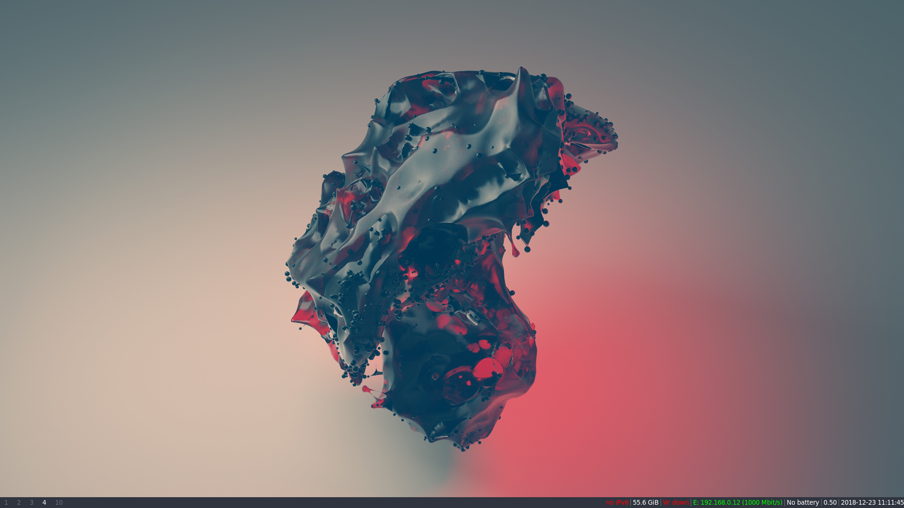

## Clean

## VS code, Rofi, URxvt

Visual Studio Code theme: Ayu Dark

## Browser, neofetch, htop

## Base and Lenv
There are currently two directories `base` and `Lenv` because I constantly switch between using my desktop and laptop I decided to create a directory for each config even though they don't vary widely (are mostly identical in fact). The Desktop version is used on a 23" monitor while the laptop one is used at 14". 

## File guide
- `config:`
	This file is used by i3/i3-gaps and should be placed in ~/.config/i3/config. The name should not be
	changed. Thus far it is still a work in progress with many configurations taken from tutorials and
	the like.

	- `Path: ~/.config/i3/config`

 - `comtpon.conf`:
	This file is used by the compositioner compton and should be placed in ~/.config/compton.conf.
	Removes screen tearing from i3 and adds transparency.
	- `Path: ~/.config/compton.conf`
    
- `rofi`:
	Configuration file for rofi an application launcher used instead of dmenu. Placed whereever but
	prefferably in ~/.config/rofi. To use a rofi-config-file run rofi with the following command
	rofi -show run -config {{location of config}} e.g. ~/.config/rofi

	- `Path: ~/.config/rofi`	

- `.bashrc`:
	Configuration file for the bash-shell, the current modifications are limited to the inclusion of
	the current git branch whenever relevant. This is done by setting force-color-prompt=yes and adding
	a function parse-git-branch, then using it when setting PS1 on lines 67-71.

	- `Path: ~/.bashrc`	

- `.Xresources`:
	Currently used for the configuration of urxvt. Should always be placed in the home directory
	~/.Xresources. If a change is made the command xrdb -merge ~/.Xresources has to be ran.
	
	- `Path: ~/.Xresources` 
